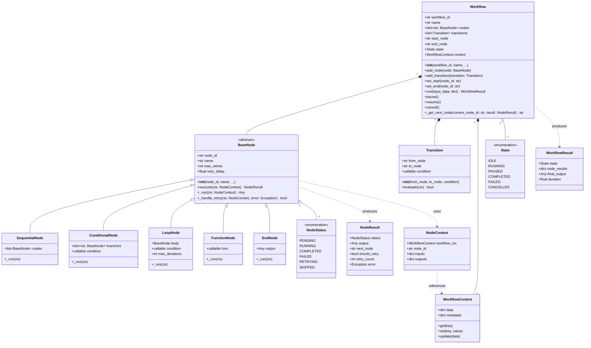
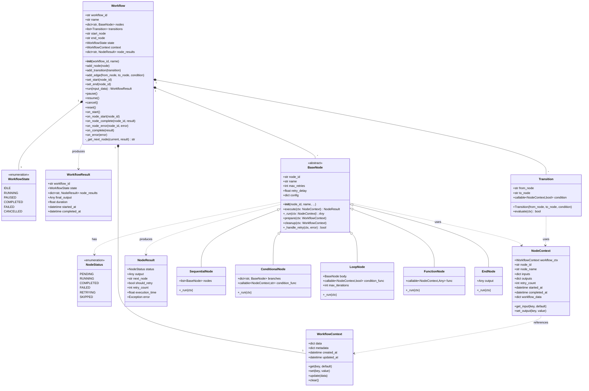
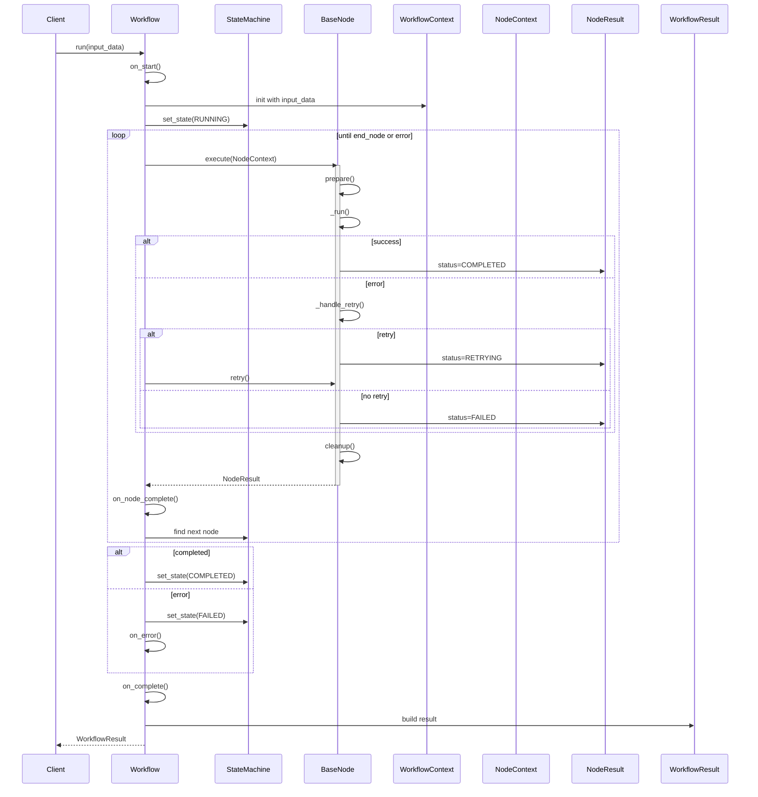
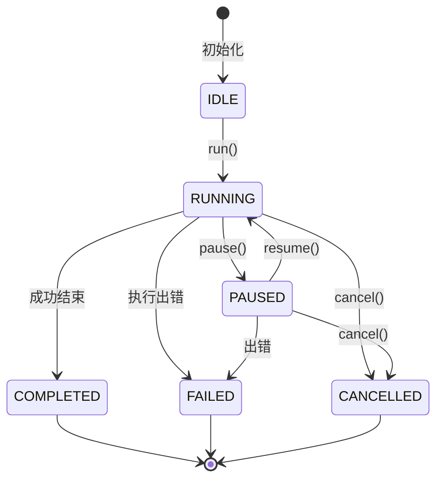
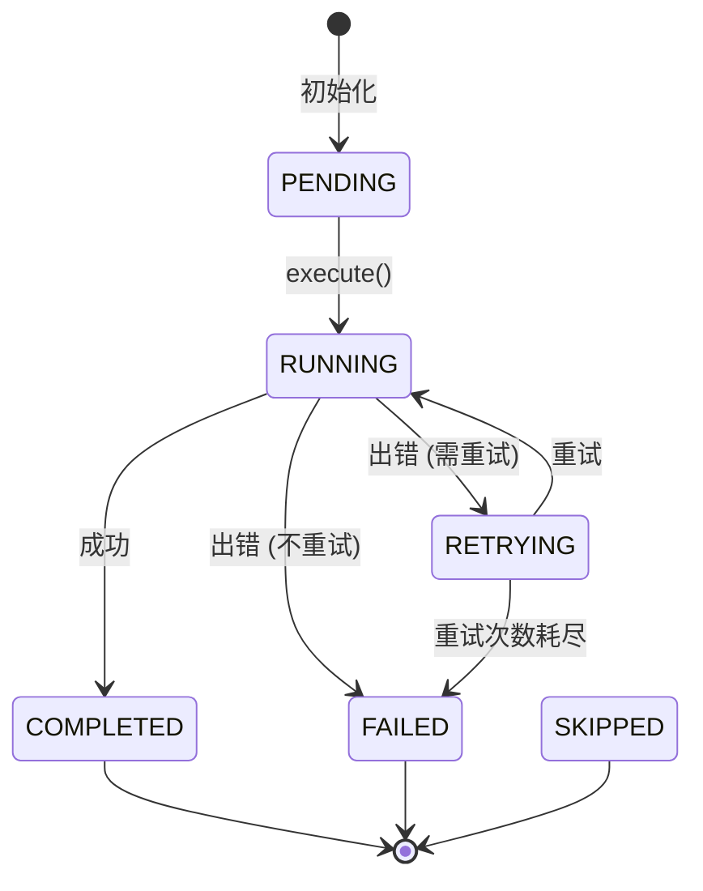

# Agent Workflow Engine 架构设计文档

## 1. 总体架构设计

### 1.1 设计理念
- **简单性**：核心代码少，易于理解和学习
- **可扩展性**：通过抽象基类支持自定义 Node 和 Workflow
- **状态驱动**：基于状态机的调度机制
- **Context 共享**：在 Node 之间安全共享数据

### 1.2 核心组件
```
Workflow Engine
├── Workflow (编排层)
│   ├── State Machine (状态机)
│   └── Transition Rules (转移规则)
├── Node (执行层)
│   ├── BaseNode (抽象基类)
│   └── Concrete Nodes (具体实现)
├── Context (数据层)
│   ├── WorkflowContext
│   └── NodeContext
└── Models ( 数据模型)
    ├── State
    ├── Result
    └── Configuration
```

## 2. 模块职责

### 2.1 `workflow_engine/core/` - 核心模块
- **workflow.py**: `Workflow` 类，负责编排 Node、管理状态转移
- **state_machine.py**: `StateMachine` 类，状态机实现
- **transition.py**: 状态转移规则定义

### 2.2 `workflow_engine/nodes/` - 节点模块
- **base.py**: `BaseNode` 抽象基类，定义 Node 接口
- **builtins.py**: 内置常用 Node 实现（如条件节点、循环节点等）
- **registry.py**: Node 注册机制（可选）

### 2.3 `workflow_engine/models/` - 数据模型
- **state.py**: `State` 枚举和状态定义
- **result.py**: `NodeResult` 和 `WorkflowResult` 数据类
- **context.py**: Context 相关数据结构
- **config.py**: 配置模型

### 2.4 `workflow_engine/exceptions/` - 异常模块
- **base.py**: 基础异常类
- **workflow.py**: Workflow 相关异常
- **node.py**: Node 相关异常

### 2.5 `workflow_engine/utils/` - 工具模块
- **logger.py**: 日志工具
- **validation.py**: 数据验证工具
- **helpers.py**: 辅助函数

### 2.6 `workflow_engine/examples/` - 示例
- 各种使用场景的示例代码

### 2.7 `workflow_engine/tests/` - 测试
- 单元测试和集成测试

## 3. 类图



## 4. 数据流

### 4.1 Workflow 执行流程
```
┌─────────────────────────────────────────────────────────┐
│                    Workflow.run()                        │
└────────────────────┬────────────────────────────────────┘
                     │
                     ▼
┌─────────────────────────────────────────────────────────┐
│  1. 初始化 WorkflowContext，设置 input_data              │
└────────────────────┬────────────────────────────────────┘
                     │
                     ▼
┌─────────────────────────────────────────────────────────┐
│  2. 设置 State = RUNNING                                 │
└────────────────────┬────────────────────────────────────┘
                     │
                     ▼
┌─────────────────────────────────────────────────────────┐
│  3. current_node = start_node                            │
└────────────────────┬────────────────────────────────────┘
                     │
         ┌───────────┴───────────┐
         │                       │
         ▼                       ▼
┌─────────────────┐    ┌─────────────────┐
│  current_node   │    │  is end_node?   │
│  is None?       │───▶│  YES            │
└────────┬────────┘    └────────┬────────┘
         │ NO                   │
         ▼                      ▼
┌─────────────────┐    ┌─────────────────┐
│  执行 Node      │    │  设置 State =   │
│  (见下方)       │    │  COMPLETED      │
└────────┬────────┘    └────────┬────────┘
         │                      │
         ▼                      ▼
┌─────────────────┐    ┌─────────────────┐
│  检查 retry     │    │  返回           │
│  (如需要)       │    │  WorkflowResult  │
└────────┬────────┘    └─────────────────┘
         │
         ▼
┌─────────────────┐
│  根据 result    │
│  找 next_node   │
└────────┬────────┘
         │
         └───────────┐
                     │
         ┌───────────┴───────────┐
         │                       │
```

### 4.2 Node 执行流程
```
┌─────────────────────────────────────────────────────────┐
│                   Node.execute()                        │
└────────────────────┬────────────────────────────────────┘
                     │
                     ▼
┌─────────────────────────────────────────────────────────┐
│  1. 创建 NodeContext                                    │
└────────────────────┬────────────────────────────────────┘
                     │
                     ▼
┌─────────────────────────────────────────────────────────┐
│  2. 设置 NodeStatus = RUNNING                           │
└────────────────────┬────────────────────────────────────┘
                     │
         ┌───────────┴───────────┐
         │                       │
         ▼                       ▼
┌─────────────────┐    ┌─────────────────┐
│  调用 _run()    │    │  捕获 Exception  │
│  成功?          │───▶│  记录错误        │
└────────┬────────┘    └────────┬────────┘
         │ YES                  │
         ▼                      ▼
┌─────────────────┐    ┌─────────────────┐
│  status =       │    │  检查 retry?     │
│  COMPLETED      │    │  should_retry?   │
└────────┬────────┘    └────────┬────────┘
         │                      │
         ▼                      ▼
┌─────────────────┐    ┌─────────────────┐
│  构建           │    │  status =        │
│  NodeResult     │    │  FAILED/RETRYING │
└─────────────────┘    └────────┬────────┘
                                │
                                ▼
                       ┌─────────────────┐
                       │  构建           │
                       │  NodeResult     │
                       └─────────────────┘
```

### 4.3 数据流向
```
Input Data
    │
    ▼
┌─────────────────────────────────────┐
│     WorkflowContext                 │
│  ┌─────────────┐  ┌──────────────┐  │
│  │ data        │  │ metadata     │  │
│  └─────────────┘  └──────────────┘  │
└─────────────────────────────────────┘
         │
         ├─────────────────────────────┐
         │                             │
         ▼                             ▼
┌─────────────────┐         ┌─────────────────┐
│  NodeContext 1  │         │  NodeContext 2  │
│  ┌───────────┐  │         │  ┌───────────┐  │
│  │ inputs    │  │         │  │ inputs    │  │
│  │ outputs   │  │────────▶│  │ outputs   │  │
│  └───────────┘  │         │  └───────────┘  │
└─────────────────┘         └─────────────────┘
         │                             │
         └─────────────────────────────┘
                             │
                             ▼
                    ┌─────────────────┐
                    │  Final Output   │
                    └─────────────────┘
```

## 5. Context 设计

### 5.1 WorkflowContext
```python
@dataclass
class WorkflowContext:
    """Workflow 级别的 Context，在所有 Node 之间共享"""
    data: Dict[str, Any] = field(default_factory=dict)
    metadata: Dict[str, Any] = field(default_factory=dict)
    created_at: datetime = field(default_factory=datetime.now)
    updated_at: datetime = field(default_factory=datetime.now)
    
    def get(self, key: str, default: Any = None) -> Any:
        """获取数据"""
        return self.data.get(key, default)
    
    def set(self, key: str, value: Any) -> None:
        """设置数据"""
        self.data[key] = value
        self.updated_at = datetime.now()
    
    def update(self, data: Dict[str, Any]) -> None:
        """批量更新数据"""
        self.data.update(data)
        self.updated_at = datetime.now()
    
    def clear(self) -> None:
        """清空数据"""
        self.data.clear()
        self.updated_at = datetime.now()
```

### 5.2 NodeContext
```python
@dataclass
class NodeContext:
    """Node 级别的 Context，包含 WorkflowContext 的引用"""
    workflow_ctx: WorkflowContext
    node_id: str
    node_name: str
    inputs: Dict[str, Any] = field(default_factory=dict)
    outputs: Dict[str, Any] = field(default_factory=dict)
    retry_count: int = 0
    started_at: Optional[datetime] = None
    completed_at: Optional[datetime] = None
    
    @property
    def workflow_data(self) -> Dict[str, Any]:
        """快捷访问 WorkflowContext 的 data"""
        return self.workflow_ctx.data
    
    def get_input(self, key: str, default: Any = None) -> Any:
        """获取输入"""
        return self.inputs.get(key, default)
    
    def set_output(self, key: str, value: Any) -> None:
        """设置输出"""
        self.outputs[key] = value
```

## 6. State 设计

### 6.1 WorkflowState (枚举)
```python
class WorkflowState(Enum):
    """Workflow 的状态"""
    IDLE = "idle"           # 初始状态，尚未运行
    RUNNING = "running"     # 正在执行
    PAUSED = "paused"       # 已暂停
    COMPLETED = "completed" # 成功完成
    FAILED = "failed"       # 执行失败
    CANCELLED = "cancelled" # 已取消
```

### 6.2 NodeStatus (枚举)
```python
class NodeStatus(Enum):
    """Node 的状态"""
    PENDING = "pending"       # 等待执行
    RUNNING = "running"       # 正在执行
    COMPLETED = "completed"   # 成功完成
    FAILED = "failed"         # 执行失败
    RETRYING = "retrying"     # 重试中
    SKIPPED = "skipped"       # 已跳过
```

### 6.3 状态转移规则

#### Workflow 状态转移
```
IDLE ──▶ RUNNING ──┬──▶ COMPLETED
                   ├──▶ FAILED
                   ├──▶ CANCELLED
                   └──▶ PAUSED ──┬──▶ RUNNING
                                ├──▶ CANCELLED
                                └──▶ FAILED
```

## 7. Workflow 生命周期

### 7.1 生命周期阶段
1. **初始化** (`__init__`)
   - 创建 Workflow 实例
   - 注册 Node
   - 配置转移规则
   - 设置起始和结束节点

2. **准备** (`prepare()`)
   - 验证配置
   - 初始化 WorkflowContext
   - 检查依赖关系

3. **运行** (`run()`)
   - 状态: IDLE → RUNNING
   - 依次执行 Node
   - 处理状态转移
   - 处理异常和重试

4. **暂停** (`pause()`) (可选)
   - 状态: RUNNING → PAUSED
   - 保存当前状态

5. **恢复** (`resume()`) (可选)
   - 状态: PAUSED → RUNNING
   - 从暂停点继续

6. **取消** (`cancel()`)
   - 状态: RUNNING/PAUSED → CANCELLED
   - 终止执行

7. **完成**
   - 状态: RUNNING → COMPLETED/FAILED
   - 返回 WorkflowResult

### 7.2 生命周期钩子
```python
class Workflow:
    def on_start(self) -> None:
        """Workflow 开始前调用"""
        pass
    
    def on_node_start(self, node_id: str) -> None:
        """Node 开始前调用"""
        pass
    
    def on_node_complete(self, node_id: str, result: NodeResult) -> None:
        """Node 完成后调用"""
        pass
    
    def on_node_error(self, node_id: str, error: Exception) -> None:
        """Node 出错时调用"""
        pass
    
    def on_complete(self, result: WorkflowResult) -> None:
        """Workflow 完成后调用"""
        pass
    
    def on_error(self, error: Exception) -> None:
        """Workflow 出错时调用"""
        pass
```

## 8. Node 生命周期

### 8.1 生命周期阶段
1. **初始化** (`__init__`)
   - 创建 Node 实例
   - 配置参数（重试次数、延迟等）

2. **准备** (`prepare()`)
   - 验证配置
   - 初始化资源

3. **执行** (`execute()`)
   - 状态: PENDING → RUNNING
   - 调用 `_run()`
   - 捕获异常
   - 处理重试

4. **重试** (`retry()`) (如需要)
   - 状态: FAILED → RETRYING
   - 等待 retry_delay
   - 重新执行

5. **完成**
   - 状态: RUNNING/RETRYING → COMPLETED/FAILED
   - 返回 NodeResult

### 8.2 Node 接口
```python
class BaseNode(ABC):
    @abstractmethod
    def _run(self, ctx: NodeContext) -> Any:
        """
        实际业务逻辑，子类必须实现
        返回值会作为 NodeResult.output
        """
        pass
    
    def prepare(self, ctx: WorkflowContext) -> None:
        """执行前的准备工作"""
        pass
    
    def cleanup(self, ctx: WorkflowContext) -> None:
        """执行后的清理工作"""
        pass
    
    def _handle_retry(self, ctx: NodeContext, error: Exception) -> bool:
        """
        判断是否需要重试
        返回 True 表示需要重试
        """
        return ctx.retry_count < self.max_retries
```

## 9. UML (Mermaid)

### 9.1 完整类图


### 9.2 时序图 - Workflow 执行


### 9.3 状态图 - Workflow


### 9.4 状态图 - Node


## 10. 为什么这样设计

### 10.1 核心设计原则

#### 1. 简单性优先
- 不追求功能最全，追求最容易理解
- 核心概念少（Workflow, Node, Context, State）
- 代码结构清晰，模块划分明确

#### 2. 可扩展性
- 通过 `BaseNode` 抽象基类，用户可以自定义任何类型的 Node
- 通过 `Transition` 支持灵活的状态转移规则
- 不限制 Node 的具体实现

#### 3. 关注点分离
- **Workflow**: 只负责编排，不关心具体业务
- **Node**: 只负责执行具体任务，不关心编排
- **Context**: 只负责数据管理，不关心执行逻辑

### 10.2 为什么这样设计 Context？

#### WorkflowContext + NodeContext 双层结构
```
优点：
- 职责清晰：WorkflowContext 负责全局数据，NodeContext 负责节点局部数据
- 安全隔离：Node 只能通过 NodeContext 访问 WorkflowContext，可控
- 可追溯：每个 Node 的输入输出都记录在 NodeContext 中
- 便于调试：可以清楚看到每个 Node 对数据的修改
```

### 10.3 为什么这样设计 State？

#### 枚举类 + 状态机
```
优点：
- 状态明确：每个状态都是预定义的，不会出现非法状态
- 可追踪：可以清楚看到 Workflow/Node 当前处于什么状态
- 便于调试：状态变化有记录，问题容易定位
```

### 10.4 为什么这样设计 Node

#### 模板方法模式
```
BaseNode.execute() 定义执行流程：
1. prepare()
2. _run() (子类实现)
3. cleanup()
4. 处理重试

优点：
- 统一执行流程
- 子类只需要关注业务逻辑 (_run)
- 公共逻辑（重试、异常处理）在父类实现
```

### 10.5 为什么支持 Retry？

#### 在 Node 层面支持重试
```
优点：
- 细粒度控制：每个 Node 可以有自己的重试策略
- 灵活：可以根据错误类型决定是否重试
- 不影响 Workflow：重试对 Workflow 透明
```

### 10.6 为什么不支持并发/分布式？

#### 专注核心功能
```
目标：学习 Workflow 原理
- 并发会增加复杂度
- 分布式会依赖外部组件（Redis等）
- 先理解核心，再扩展
```

### 10.7 为什么用 dataclass？

#### 简洁的数据模型
```
优点：
- 代码简洁，减少样板代码
- 自动生成 __init__, __repr__, __eq__ 等
- 适合定义数据结构
- Python 3.12 原生支持
```

### 10.8 为什么用 ABC？

#### 强制接口规范
```
优点：
- 确保子类实现必要的方法 (_run)
- 类型检查支持
- 文档清晰
```

### 10.9 扩展性考虑

#### 未来可以扩展的方向
1. **并发支持**: 加一个 `ParallelNode`
2. **持久化**: 保存 Workflow 状态到数据库
3. **可视化**: 生成 Workflow 图
4. **监控**: 收集执行指标
5. **远程执行**: Node 可以在远程执行

## 11. 总结

这个设计的核心思想：
1. **状态机驱动**：Workflow 本质是一个状态机
2. **节点编排**：通过 Node 和 Transition 实现灵活编排
3. **Context 共享**：双层 Context 设计，既共享又隔离
4. **简单可扩展**：核心简单，但可以扩展各种功能

适合学习 Agent Workflow 原理，也可以作为实际项目的基础框架。
